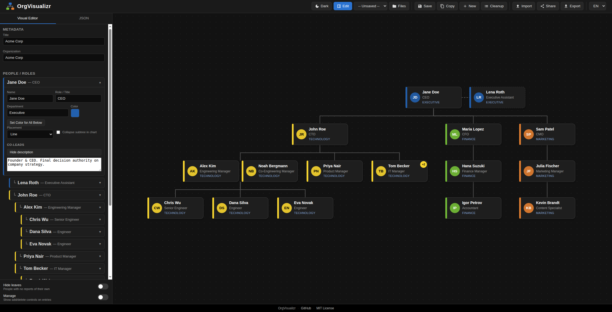

# OrgVisualizr

OrgVisualizr is a small, client-side web app for visualizing organizational charts in a modern, card-based style. It's built to be **crafted text-based and imported for render**: the org chart is a single JSON document that you can edit as a form (Visual editor) or as raw text (JSON editor) — both stay in sync, either one can drive the other.

There is **no backend, no build step, no database**. It runs entirely in the browser.

**[Live demo via GitHub-Pages](https://dbraun1991.github.io/OrgVisualizr/)**

OrgVisualizr UI:



## Quick Start

Running locally is only needed if you want to work on the source — the [live demo](https://dbraun1991.github.io/OrgVisualizr/) above needs nothing installed.

Since the app uses ES6 modules (`type="module"`), you can't open `index.html` directly from `file://` — serve it via a local web server:

```bash
python3 -m http.server 8000
```

Then open `http://localhost:8000`.

## Features

- **Visual + JSON dual editor** — edit via forms, or edit the raw JSON directly; changes in either one instantly re-render the chart and stay synchronized with the other.
- **Modern card-based rendering** — D3.js-rendered SVG cards (name, role, department, department-color accent, initials avatar) connected with clean orthogonal connectors, pan/zoom enabled.
- **Zoom and grid controls** — a slider pinned to the canvas's lower-right corner sets/reads the zoom level (20–300%), alongside a second slider for the background dot-grid's opacity.
- **Collapsible subtrees** — click any node with reports to collapse/expand its branch; shows a "+N" badge for hidden descendants.
- **Co-leadership** — a position can be jointly held by multiple people (co-leads, job-sharing), rendered as a card cluster.
- **Staff placement** — assistant/support roles can render beside their manager with a dashed connector instead of stacked below, matching the classic line-vs-staff org-chart convention.
- **Hide leaves** — a switch pinned at the bottom of the editor sidebar globally hides everyone with no reports of their own, replacing them with a "+N" badge on their manager, so you can see the shape of the management structure without the individual-contributor noise.
- **Set Color for All Below** — recolor a whole subtree (reports, their reports, and so on) to match a node's color in one click.
- **Guardrailed delete** — a node can only be deleted once nothing reports to it anymore, direct or indirect; deleting always asks for confirmation.
- **Manage mode** — a switch next to "Hide leaves" reveals the add/delete controls on each entry in the sidebar; off by default so browsing and editing existing fields isn't cluttered with structural-edit buttons.
- **Local save/load, with a proper manager** — named charts saved to browser `localStorage`; the header's "Files" button opens a modal listing every saved chart with load and delete actions.
- **Import** — from a local JSON file (picker or drag-and-drop) or a remote HTTPS/HTTP URL.
- **Export** — as JSON, SVG, PNG, PDF, or a nested-list Text/Markdown summary.
- **Sections view** — a second, more abstract view (header toggle) that steps back from individuals: one box per department, with named sub-group boxes inside, sorted and indented by tier, outlined in each section's own lead's color. Driven by an optional `group` field per node; shares "Hide leaves" with the tree view.
- **Light and dark themes** — toggle in the header; persisted per-browser, applied before first paint (no flash).
- **Localization** — English and German, with more languages easy to add.

## Documentation

This README covers the essentials for using the app. For everything else:

- **[docs/dsl.md](docs/dsl.md)** — the full data model / DSL reference: every field, validation rule, and worked examples (minimal chart, co-leadership, staff placement, collapsed subtrees).
- **[agents.md](agents.md)** — architecture, module responsibilities, key files, and how the pieces fit together. Written for anyone (human or AI agent) working on the codebase itself.
- **[docs/adrs/](docs/adrs)** — Architecture Decision Records, one per significant design decision, kept up to date as the reasoning behind them evolves:

  | ADR | Decision |
  |-----|----------|
  | [ADR-001](docs/adrs/ADR-001-tech-stack.md) | Vanilla JS + D3.js + Alpine.js, no backend, no build step |
  | [ADR-002](docs/adrs/ADR-002-data-model-and-dsl.md) | Flat `nodes[]` with `parentId` (strict tree); JSON is the DSL |
  | [ADR-003](docs/adrs/ADR-003-persistence-and-sharing.md) | `localStorage` + JSON/SVG/PNG/PDF export, no backend (share links removed, see ADR update) |
  | [ADR-004](docs/adrs/ADR-004-co-occupancy-and-staff-placement.md) | Co-leadership (`coOccupants`) and staff placement (`placement`) as attributes on the strict tree, not new edge types |
  | [ADR-005](docs/adrs/ADR-005-editor-guardrails-and-view-controls.md) | Delete only when childless; "Hide leaves"/"Manage" as view-only state, not data; saved charts deletable via the Files modal |
  | [ADR-006](docs/adrs/ADR-006-sections-view.md) | Sections view: a second, more abstract department/group view, driven by a new optional `group` field |

## License

MIT — see [LICENSE](LICENSE).
